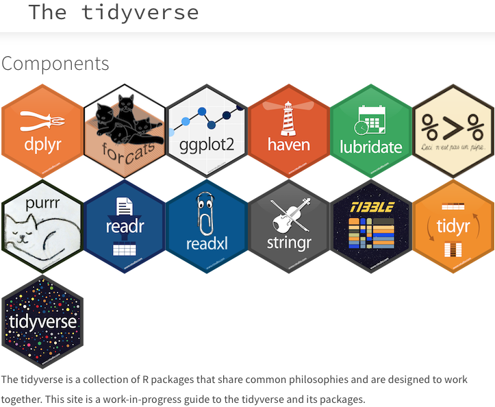

# Loading packages 

```{r warning=FALSE, message=FALSE, error=FALSE}
## Use the code below to check if you have all required packages installed. If some are not installed already, the code below will install these. If you have all packages installed, then you could load them with the second code.
requiredPackages = c('tidyverse', 'languageR')
for(p in requiredPackages){
  if(!require(p,character.only = TRUE)) install.packages(p)
  library(p,character.only = TRUE)
}
```


# The `Tidyverse`

## Introduction

The `Tidyverse` is a family of packages used to speed up the use of R. 



You need to first install it (if you haven't already done so) and then load it. To install, use `Tools > Install packages` or `install.packages()` then add tidyverse. To load a package, use the `library()` function.


Look at how many packages are installed within the `Tidyverse`. The messages you see are telling you which packages are loaded and which functions are in conflict (i.e., these are functions from other packages that are found within the `Tidyverse`). If you want to use the original function, simply add `package_name::function`.


## Visualisation

In the `tidyverse`, the package for making elegant plots is called `ggplot2`. It works a lot like how pipes work, but since it was originally designed as a separate package, it uses `+` instead of `%>%`.

### First steps

#### Empty plot area

Let's produce a basic plot with nothing drawn on it. 
This is the basic plotting area in `R`. We need to then add layers on top of it to show our plot

```{r}
english %>% 
  ggplot() +
  theme_bw()
```


#### Adding x and y values

Let's add the x and y values from our dataset. X = subjective familiarity rating, y = RT in Visual Lexical Decision task


```{r}
english %>% 
  ggplot(aes(x = Familiarity, 
             y = RTlexdec)) +
  theme_bw()
```


There are no differences between the two. We need to tell `ggplot2` to add a geometric function for plotting


#### Adding geoms

Geoms are integrated within `ggplot2` to obtain various types of plots. 

```{r}
english %>% 
  ggplot(aes(x = Familiarity, 
             y = RTlexdec)) +
  theme_bw() +
  geom_point()
```


#### Adding line of best fit 

We will add a line of best fit. This is used to evaluate presence/absence of a relationship between two numeric variables


```{r}
english %>% 
  ggplot(aes(x = Familiarity, 
             y = RTlexdec)) +
  theme_bw() +
  geom_point() +
  geom_smooth(method = "lm") # line of best fit based on the lm() method
```


The result shows a nice negative correlation! RT lexical decision decreases when familiarity rating increases. 

We can ask, are there differences related to the word category, i.e., verb vs noun?


#### By word category

We change colour by levels of word category;

```{r}
english %>% 
  ggplot(aes(x = Familiarity, 
             y = RTlexdec,
             colour = WordCategory)) + # add colour to the base aesthetics
  theme_bw() +
  geom_point() +
  geom_smooth(method = "lm")
```


#### Making final touches

Let's add a title and a subtitle, change x and y labels, change size of overall plot, and colours of the categories.


```{r}
english %>% 
  ggplot(aes(x = Familiarity, 
             y = RTlexdec,
             colour = WordCategory)) + # add colour to the base aesthetics
  theme_bw() +
  geom_point() +
  geom_smooth(method = "lm") +
  labs(x = "Familiarity rating", y = "RT Lexical Decision", title = "Familiarity rating vs RT in a lexical decision task", subtitle = "with a trend line") + # add labels
  theme(text = element_text(size = 15)) + # increase size of plot
  theme(legend.position = "bottom", legend.title = element_blank()) + # remove legend title and change position
  scale_color_manual(labels = c("Nouns", "Verbs"), values = c("blue", "red")) # change colours and names of legend

```


To choose colours, use the addin `colourpicker` from above. See this [link](http://applied-r.com/r-color-tables/) for full list of colours available. Use colours that are colour-blind friendly [here](https://cran.r-project.org/web/packages/colorBlindness/vignettes/colorBlindness.html)


### Activity on your own 3

Work through a few examples to plot data


```{r}

```


## Additional plots

We looked above at one example of plots (with points). We could use additional types of plots.


### A bar plot

Will show barplots of the dataset

```{r}
english %>%
  ggplot(aes(x = RTlexdec, 
             colour = AgeSubject)) +
  theme_bw() +
  geom_bar()
```


And another view with error bars! This is a nice example that shows how you can combine multiple chains with the pipe:

- Group by Age of subject
- Compute mean and SD
- use ggplot2 syntax to plot a barplot and error bars


```{r}
english %>%
  group_by(AgeSubject) %>%
  summarise(
    sd = sd(RTlexdec),
    RTlexdecM = mean(RTlexdec)
  ) %>% 
  ggplot(aes(x = AgeSubject, 
             y = RTlexdecM)) +
  theme_bw() +
  geom_col(fill = "lightgray", color = "black") +
  geom_errorbar(aes(ymin = RTlexdecM-sd, ymax = RTlexdecM+sd), width = 0.2)
```

### A histogram

This looks at the distribution of the variable. We look at a histogram 

```{r}
english %>%
  ggplot(aes(x = RTlexdec, 
             colour = AgeSubject)) +
  theme_bw() +
  geom_histogram(fill = "white") +
  scale_color_manual(values = c("red", "blue"))
```


### A density plot

This looks at the distribution of the variable. We see that the two variables have different means. We can superpose the density plot on top of the histogram or have the density plot on its own.

```{r}
# histogram and density plot
english %>%
  ggplot(aes(x = RTlexdec, 
             colour = AgeSubject)) +
  theme_bw() +
  geom_histogram(aes(y = ..density..), fill = "white") +
  scale_color_manual(values = c("red", "blue")) +
  geom_density()

# density plot only
english %>%
  ggplot(aes(x = RTlexdec, 
             colour = AgeSubject)) +
  theme_bw() +
  geom_density()
```


### A boxplot

This allows you to see various information, including the Median, SD, Quartiles (25% and 75%) and outliers. Looking at the medians, we see clear difference between the two distributions. 

```{r}
english %>%
  ggplot(aes(x = AgeSubject, 
             y = RTlexdec)) +
  theme_bw() +
  geom_boxplot()
```


### A Violin plot

This allows you to see various information, including the Median, SD, Quartiles (25% and 75%) and outliers. Looking at the medians, we see clear difference between the two distributions. 

```{r}
english %>%
  ggplot(aes(x = AgeSubject, 
             y = RTlexdec)) +
  theme_bw() +
  geom_violin()
```


## Facet_grid

The plots we used so far allowed to plot data as a function of one categorical variable, e.g., `AgeSubject`. What if we wanted to show the different patterns emerging when combining `AgeSubject` (old vs young), `WordCategory` (Noun or Verb), `CV` (Consonant or Vowel) and `Voice` (Voiced and Voiceless) ?
What if we also wanted to modify the labels and order of levels of variables? 

We will start slowly below to show how we can combine two categorical variables and extend them to additional ones 

### Two categorical variables

#### First steps

Here we obtain a boxplot with two categorical variables `AgeSubject` and `WordCategory`

```{r}
english %>%
  ggplot(aes(x = AgeSubject, 
             y = RTlexdec)) +
  theme_bw() +
  geom_boxplot() +
  facet_grid(~ WordCategory)
```


#### Changing order of levels within a variable and its labels

What would you do to change both order of levels within a variable and its labels? We want to change order for `AgeSubject` to be Young vs Old (rather than old vs young) and change labels of `WordCategory` from N vs V to Noun vs Verb.

Work on this with your peers. Answer is below!


##### Activity on your own 1

```{r}
english %>%
  ggplot(aes(x = AgeSubject, 
             y = RTlexdec)) +
  theme_bw() +
  geom_boxplot() +
  facet_grid(~ WordCategory)

```


##### Answer


```{r}
english %>%
  mutate(AgeSubject = factor(AgeSubject, levels = c("young", "old"), labels = c("Young", "Old")),
         WordCategory = factor(WordCategory, labels = c("Noun", "Verb"))) %>% 
  ggplot(aes(x = AgeSubject, 
             y = RTlexdec)) +
  theme_bw() +
  geom_boxplot() +
  facet_grid(~ WordCategory)
```

### Three or more categorical variables

Let us obtain a boxplot with four categorical variables `AgeSubject`, `WordCategory`, `CV` and `Voice`. We still need to change names.
We can also add `margins = TRUE` to obtain mean values for all categories (under `all`). We can also use `scale = "free"` to change limits of the `y-axis`.

Of course this figure is so complex that it needs a lot of interpretation. But it allows you to see how we can use `facet_grid` to get more categorical variables in. This visualisation suggests that there are no clear differences when plotting results by this 4-way interaction as we always have clear differences between "Young" and "Old" participants, with "Young" being faster than "Old" participants.


```{r}
english %>%
  mutate(AgeSubject = factor(AgeSubject, levels = c("young", "old"), labels = c("Young", "Old")),
         WordCategory = factor(WordCategory, labels = c("Noun", "Verb")),
         CV = factor(CV, labels = c("Consonant", "Vowel"))) %>% 
  ggplot(aes(x = AgeSubject, 
             y = RTlexdec)) +
  theme_bw() +
  geom_boxplot() +
  facet_grid(CV + Voice ~ WordCategory, margins = TRUE, scales = "free")
```


### Comparing two numeric outcomes


What if we want to compare performance in relation to reaction time for the lexical decision task (RTlexdec) and reaction time for naming (RTnaming). We want to see if there are differences related to the `AgeSubject`, `WordCategory`.
We use `pivot_longer` here to do change the format of our table and then change names and use `facet_grid`.


```{r}
english %>%
  select(RTlexdec, RTnaming, AgeSubject, WordCategory) %>% 
  pivot_longer(cols = c(RTlexdec, RTnaming),
               names_to = "variable",
               values_to = "values") %>% 
  mutate(AgeSubject = factor(AgeSubject, levels = c("young", "old"), labels = c("Young", "Old")),
         WordCategory = factor(WordCategory, labels = c("Noun", "Verb"))) %>% 
  ggplot(aes(x = variable, 
             y = values)) +
  theme_bw() +
  geom_boxplot() +
  facet_grid(AgeSubject ~ WordCategory, margins = TRUE, scales = "free")
```


## Exporting images

When you use Rmarkdown, your figures are already embedded within the generated output. If you are using an R script and/or want to add the figure in a different document, you can use the following code:


```{r}
jpeg(filename = "test.jpeg", width = 15, height = 15, units = "cm", res = 300)

english %>%
  select(RTlexdec, RTnaming, AgeSubject, WordCategory) %>% 
  pivot_longer(cols = c(RTlexdec, RTnaming),
               names_to = "variable",
               values_to = "values") %>% 
  mutate(AgeSubject = factor(AgeSubject, levels = c("young", "old"), labels = c("Young", "Old")),
         WordCategory = factor(WordCategory, labels = c("Noun", "Verb"))) %>% 
  ggplot(aes(x = variable, 
             y = values)) +
  theme_bw() +
  geom_boxplot() +
  facet_grid(AgeSubject ~ WordCategory, margins = TRUE, scales = "free")
dev.off()

```

The image is automatically saved into your working directory and you can import it to your word (\LaTeX) document.

You can use any device to save the output. Jpeg, PNG, PDF, TIFF, etc.. 
From an R script, you can run the code and then the image will appear within the "Plots" area. Simply click on export and you will be able to save the image.


## Conclusion

As you can see, visualisations in `R` using the `Tidyverse` provide you with many options and you can explore these further.

See [here](https://ggplot2.tidyverse.org/reference/) for a full list of geoms. This will help you in thinking about visualisation.

See extensions to ggplot2 [here](https://exts.ggplot2.tidyverse.org/gallery/) for additional plugins to enhance plots.

In the next section, we start with initial inferential statistics.


## Going further

See [here](https://ggplot2.tidyverse.org/reference/) for a full list of geoms. This will help you in thinking about visualisation.

See extensions to ggplot2 [here](https://exts.ggplot2.tidyverse.org/gallery/) for additional plugins to enhance plots. 

# End of the session

This is the end of the third session. We used the package `Tidyverse` to manipulate objects. We obtained then basic summaries and basic plots. We looked at how to build a plot from scratch 

Next week, we will look at basic inferential statistics


# session info

```{r warning=FALSE, message=FALSE, error=FALSE}
sessionInfo()
```


