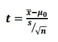

# Loading packages 

```{r}
## Use the code below to check if you have all required packages installed. If some are not installed already, the code below will install these. If you have all packages installed, then you could load them with the second code.
requiredPackages = c('tidyverse', 'languageR', 'Hmisc', 'corrplot', 'broom', 'knitr', 'xtable', 'ggsignif')
for(p in requiredPackages){
  if(!require(p,character.only = TRUE)) install.packages(p)
  library(p,character.only = TRUE)
}
```


# Inferential statistics

## Introduction

What do we mean by inferential statistics? We want to evaluate if there are differences observed between two groups of datapoints and if these differences are statistically significant. 

For this, we need to pay attention to the format of our outcome and predictors. An outcome is the response variable (or dependent variable); a predictor is our independent variable(s). 

## Type of outcomes

It is important to know the class of the outcome before doing any pre-data analyses or inferential statistics. Outcome classes can be one of:

1. `Numeric`: As an example, we have length/width of leaf; height of mountain; fundamental frequency of the voice; etc. These are `true` numbers and we can use summaries, t-tests, linear models, etc. Integer are a family of numeric variables and can still be considered as a normal numeric variable.

2. `Categorical` (Unordered): Observations for two or more categories. As an example, we can have gender of a speaker (male or female); responses to a True vs False perception tests; Colour (unordered) categorisation, e.g., red, blue, yellow, orange, etc.. For these we can use a Generalised Linear Model (binomial or multinomial) or a simple chi-square test. Count data are numbers related to a category. But these should be analysed using a poisson logistic regression

3. `Categorical` (Ordered): When you run a rating experiment, where the outcome is either `numeric` (i.e., 1, 2, 3, 4, 5) or `categories` (i.e., disagree, neutral, agree). The `numeric` option is NOT a true number as for the participant, these are categories. Cumulative Logit models (or Generalised Linear Model with a cumulative function) are used. The mean is meaningless here, and the median is a preferred descriptive statistic.


## Correlation tests

### Basic correlations

Let us start with a basic correlation test. We want to evaluate if two numeric variables are correlated with each other.

We use the function `cor` to obtain the pearson correlation and `cor.test` to run a basic correlation test on our data with significance testing

```{r}
cor(english$RTlexdec, english$RTnaming, method = "pearson")
cor.test(english$RTlexdec, english$RTnaming)
```

What these results are telling us? There is a positive correlation between `RTlexdec` and `RTnaming`. The correlation coefficient (R²) is 0.76 (limits between -1 and 1). This correlation is statistically significant with a t value of 78.699, degrees of freedom of 4566 and a p-value < 2.2e-16. 

What are the degrees of freedom? These relate to number of total observations - number of comparisons. Here we have 4568 observations in the dataset, and two comparisons, hence 4568 - 2 = 4566.

For the p value, there is a threshold we usually use. This threshold is p = 0.05. This threshold means we have a minimum to consider any difference as significant or not. 0.05 means that we have a probability to find a significant difference that is at 5% or lower. IN our case, the p value is lower that 2.2e-16. How to interpret this number? this tells us to add 15 0s  before the 2!! i.e., 0.0000000000000002. This probability is very (very!!) low. So we conclude that there is a statistically significant correlation between the two variables.


The formula to calculate the t value is below. 




x̄ = sample mean
μ0 = population mean
s = sample standard deviation
n = sample size

The p value is influenced by various factors, number of observations, strength of the difference, mean values, etc.. You should always be careful with interpreting p values taking everything else into account.


### Using the package `corrplot`

Above, we did a correlation test on two predictors. 
What if we want to obtain a nice plot of all numeric predictors and add significance levels? 

#### Correlation plots

```{r fig.height=6}
corr <- 
  english %>% 
  select(where(is.numeric)) %>% 
  cor()
print(corr)
corrplot(corr, method = 'ellipse', type = 'upper')

```


#### More advanced

Let's first compute the correlations between all numeric variables and plot these with the p values

```{r fig.height=15}
## correlation using "corrplot"
## based on the function `rcorr' from the `Hmisc` package
## Need to change dataframe into a matrix
corr <- 
  english %>% 
  select(where(is.numeric)) %>% 
  as.matrix(english) %>% 
  rcorr(type = "pearson")
print(corr)
# use corrplot to obtain a nice correlation plot!
corrplot(corr$r, p.mat = corr$P,
         addCoef.col = "black", diag = FALSE, type = "upper", tl.srt = 55)
```


# Linear Models

Up to now, we have looked at descriptive statistics, and evaluated summaries, correlations in the data (with p values).

We are now interested in looking at group differences. 


## Introduction

The basic assumption of a Linear model is to create a regression analysis on the data. We have an outcome (or dependent variable) and a predictor (or an independent variable). The formula of a linear model is as follows `outcome ~ predictor` that can be read as "outcome as a function of the predictor". We can add "1" to specify an intercept, but this is by default added to the model

### Model estimation

```{r}
english2 <- english %>% 
  mutate(AgeSubject = factor(AgeSubject, levels = c("young", "old")))
mdl.lm <- english2 %>% 
  lm(RTlexdec ~ AgeSubject, data = .)
#lm(RTlexdec ~ AgeSubject, data = english)
mdl.lm #also print(mdl.lm)
summary(mdl.lm)
```

### Tidying the output

```{r}
# from library(broom)
tidy(mdl.lm) %>% 
  select(term, estimate) %>% 
  mutate(estimate = round(estimate, 3))
mycoefE <- tidy(mdl.lm) %>% pull(estimate)

```

Obtaining mean values from our model

```{r}
#old
mycoefE[1]
#young
mycoefE[1] + mycoefE[2]
```

### Nice table of our model summary

We can also obtain a nice table of our model summary. We can use the package `knitr` or `xtable`

#### Directly from model summary

```{r}
kable(summary(mdl.lm)$coef, digits = 3)

```

#### From the `tidy` output

```{r}
mdl.lmT <- tidy(mdl.lm)
kable(mdl.lmT, digits = 3)
```


### Dissecting the model

Let us dissect the model. If you use "str", you will be able to see what is available under our linear model. To access some info from the model

#### "str" and "coef"

```{r}
str(mdl.lm)
```


```{r}
coef(mdl.lm)
## same as 
## mdl.lm$coefficients
```

#### "coef" and "coefficients"

What if I want to obtain the "Intercept"? Or the coefficient for distance? What if I want the full row for distance?

```{r}
coef(mdl.lm)[1] # same as mdl.lm$coefficients[1]
coef(mdl.lm)[2] # same as mdl.lm$coefficients[2]
```


```{r}
summary(mdl.lm)$coefficients[2, ] # full row
summary(mdl.lm)$coefficients[2, 4] #for p value
```


#### Residuals

What about residuals (difference between the observed value and the estimated value of the quantity) and fitted values? This allows us to evaluate how normal our residuals are and how different they are from a normal distribution.

```{r warning=FALSE, message=FALSE, error=FALSE}
hist(residuals(mdl.lm))
qqnorm(residuals(mdl.lm)); qqline(residuals(mdl.lm))
plot(fitted(mdl.lm), residuals(mdl.lm), cex = 4)
```

#### Goodness of fit?

```{r warning=FALSE, message=FALSE, error=FALSE}
AIC(mdl.lm)	# Akaike's Information Criterion, lower values are better
BIC(mdl.lm)	# Bayesian AIC
logLik(mdl.lm)	# log likelihood
```


Or use the following from `broom`

```{r}
glance(mdl.lm)
```

#### Significance testing

Are the above informative? of course not directly. If we want to test for overall significance of model. We run a null model (aka intercept only) and compare models.

```{r warning=FALSE, message=FALSE, error=FALSE}
mdl.lm.Null <- english %>% 
  lm(RTlexdec ~ 1, data = .)
mdl.comp <- anova(mdl.lm.Null, mdl.lm)
mdl.comp
```

The results show that adding the variable "AgeSubject" improves the model fit. We can write this as follows: Model comparison showed that the addition of AgeSubject improved the model fit when compared with an intercept only model ($F$(`r mdl.comp[2,3]`) = `r round(mdl.comp[2,5], 2)`, *p* < `r mdl.comp[2,6]`)  (F(1) = 4552 , p < 2.2e-16)

#### Add significance levels and trend line on a plot?

We can use the p values generated from either our linear model to add significance levels on a plot. We use the code from above and add the significance level. We also add a trend line


```{r warning=FALSE, message=FALSE, error=FALSE}
english %>% 
  ggplot(aes(x = AgeSubject, y = RTlexdec))+
  geom_boxplot()+
  theme_bw() + theme(text = element_text(size = 15))+
  geom_smooth(aes(x = as.numeric(AgeSubject), y = predict(mdl.lm)), method = "lm", color = "blue") + 
  geom_signif(comparison = list(c("old", "young")), 
              map_signif_level = TRUE, test = function(a, b) {
                list(p.value = summary(mdl.lm)$coefficients[2, 4]
)})
```


## Multiple predictors?

Linear models require a numeric outcome, but the predictor can be either numeric or a factor. We can have more than one predictor. The only issue is that this complicates the interpretation of results

```{r warning=FALSE, message=FALSE, error=FALSE}
english %>% 
  lm(RTlexdec ~ AgeSubject * WordCategory, data = .) %>% 
  summary()
```


And with an Anova


```{r warning=FALSE, message=FALSE, error=FALSE}
english %>% 
  lm(RTlexdec ~ AgeSubject * WordCategory, data = .) %>% 
  anova()
```


The results above tell us that all predictors used are significantly different.


# End of the session

This is the end of the fourth session. We continued working with the `Tidyverse` to obtain visualisations and added more complex specifications. We then looked at correlation tests and inferential statistics. We looked at a t-test, an anova and a linear model. 


# session info

```{r}
sessionInfo()
```


